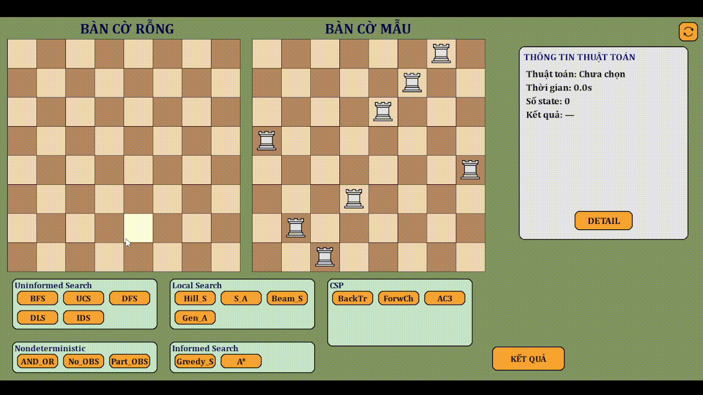
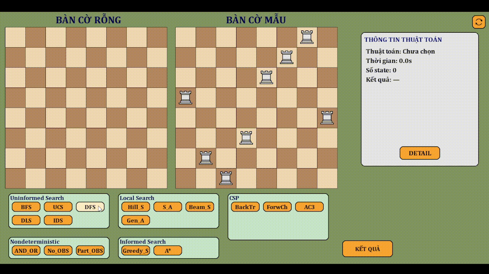
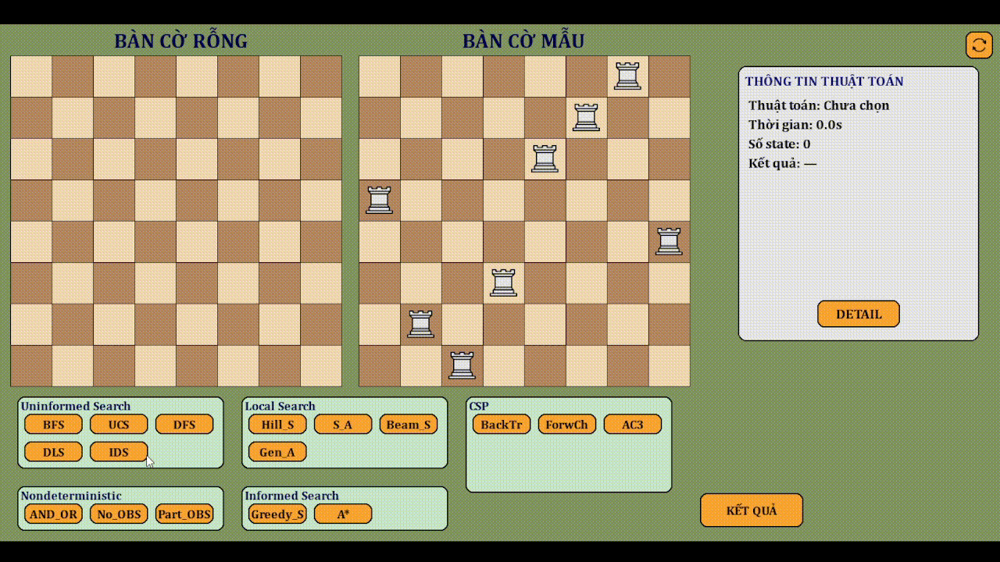
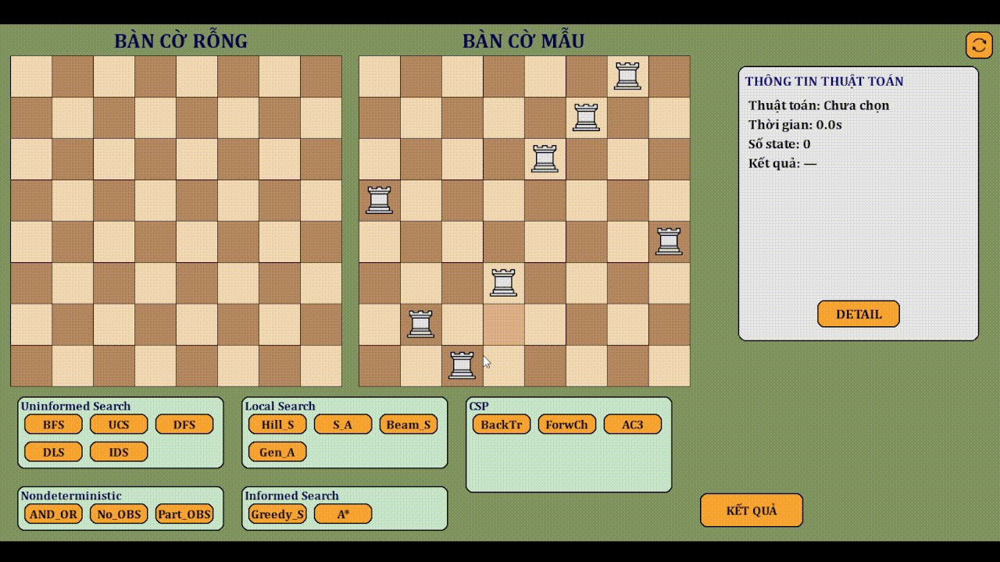
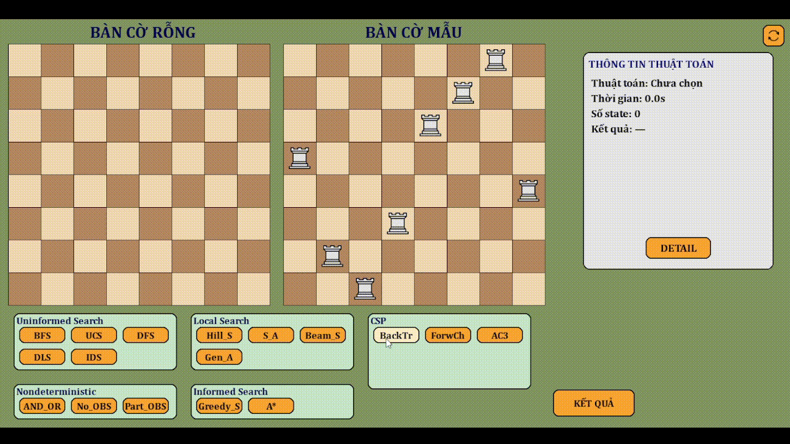

# README - Giải Bài Toán 8 Quân Xe

## Mục Lục

- [Tổng Quan](#tổng-quan)
- [Tính Năng](#tính-năng)
- [Cấu Trúc File](#cấu-trúc-file)
- [Yêu Cầu](#yêu-cầu)
- [Cách Chạy](#cách-chạy)
- [Hướng Dẫn Sử Dụng](#hướng-dẫn-sử-dụng)
- [Mô Tả Thuật Toán](#mô-tả-thuật-toán)
- [Minh Họa Thuật Toán (GIF)](#minh-họa-thuật-toán-gif)
- [Lưu Ý](#lưu-ý)

## Tổng Quan

Đây là project cá nhân (cho môn _Trí Tuệ Nhân Tạo_) phục vụ cho việc trực quan hóa giải bài toán **8 quân xe**, đặt 8 quân xe trên bàn cờ 8x8 sao cho không quân nào đe dọa lẫn nhau (không cùng hàng hoặc cột). Sử dụng Pygame để thiết kế giao diện và triển khai nhiều thuật toán tìm kiếm.

## Tính Năng

- **Giao diện đồ họa**: Hiển thị bàn cờ, trạng thái hiện tại, trạng thái mục tiêu và thông tin thuật toán.
- **Thuật toán**:
  - **Tìm kiếm không thông tin**: BFS, UCS, DFS, DLS, IDS.
  - **Tìm kiếm có thông tin**: Greedy Search, A\*.
  - **Tìm kiếm cục bộ**: Hill Climbing, Simulated Annealing, Beam Search, Genetic Algorithm.
  - **Tìm kiếm không xác định**: AND-OR, No Observation, Partial Observation.
  - **CSP**: Backtracking, Forward Checking, AC3
- **Tương tác**: Chọn thuật toán, xem từng bước, xem chi tiết đường đi và đặt lại bàn cờ.
- **Hiệu suất**: Hiển thị thời gian chạy, số trạng thái duyệt và kết quả thành công/thất bại.

## Cấu Trúc File

- `main.py`: Khởi chạy ứng dụng và giao diện Pygame.
- `ui.py`: Vẽ bàn cờ, nút bấm và bảng thông tin.
- `controller.py`: Quản lý thực thi thuật toán và tính toán kết quả.
- `algorithm.py`: Thuật toán tìm kiếm không và có thông tin.
- `localsearch.py`: Thuật toán tìm kiếm cục bộ.
- `nondeterministic.py`: Thuật toán tìm kiếm không xác định.
- `Demo_NoOBS.py`: Thuật toán No Observation.
- `Demo_PartialOBS.py`: Thuật toán Partial Observation.
- `CSP.py`: Thuật toán Backtracking Forward Checking và AC3.
- `imgs/`: Chứa hình ảnh và các gif chạy demo các thuật toán.

## Yêu Cầu

- Python 3.x
- Thư viện:
  - `pygame`: Giao diện đồ họa.
  - `numpy`: Xử lý ma trận.
  - Các thư viện chuẩn: `heapq`, `collections`, `random`, `time`, `math`, `itertools`.

Cài đặt:

```bash
pip install pygame numpy
```

## Cách Chạy

1. Cài đặt thư viện cần thiết.
2. Chạy lệnh:
   ```bash
   python main.py
   ```
3. Giao diện hiển thị:
   - Bàn cờ rỗng (trái) và trạng thái mục tiêu (phải).
   - Nút chọn thuật toán theo nhóm (Uninformed, Informed, Local, Nondeterministic, CSP).
   - Bảng thông tin hiển thị tên thuật toán, thời gian, số trạng thái và kết quả.
   - Nút "KẾT QUẢ" để chạy hết thuật toán và nút "DETAIL" để xem chi tiết.

## Hướng Dẫn Sử Dụng

- **Chọn thuật toán**: Nhấn nút (BFS, A\*, Backtracking, v.v.) để chạy thuật toán.
- **Xem từng bước**: Bàn cờ cập nhật theo từng bước của thuật toán.
- **Xem kết quả**: Nhấn "KẾT QUẢ" để chạy toàn bộ và xem kết quả cuối.
- **Xem chi tiết**: Nhấn "DETAIL" để xem danh sách tọa độ đặt quân xe từng bước.
- **Đặt lại**: Nhấn nút refresh (góc trên phải) để làm mới bàn cờ.
- **Thoát chi tiết**: Nhấn "EXIT" trong bảng chi tiết để trở về giao diện chính.

## Mô Tả Thuật Toán

- **Tìm kiếm không thông tin**:
  - **BFS**: Duyệt theo chiều rộng.
  - **UCS**: Duyệt theo chi phí thấp nhất.
  - **DFS**: Duyệt theo chiều sâu.
  - **DLS**: DFS giới hạn độ sâu.
  - **IDS**: Lặp DLS với độ sâu tăng dần.
- **Tìm kiếm có thông tin**:
  - **Greedy Search**: Dựa trên heuristic (số quân xe đặt sai).
  - **A\***: Kết hợp heuristic và chi phí đường đi.
- **Tìm kiếm cục bộ**:
  - **Hill Climbing**: Chọn hàng xóm tốt nhất theo heuristic.
  - **Simulated Annealing**: Chấp nhận bước xấu với xác suất giảm dần.
  - **Beam Search**: Giữ số trạng thái tốt nhất cố định mỗi bước.
  - **Genetic Algorithm**: Tiến hóa quần thể qua lai ghép và đột biến.
- **Tìm kiếm không xác định**:
  - **AND-OR**: Xử lý hành động không xác định với tỷ lệ lỗi.
  - **No Observation**: Tìm kiếm trên tập belief state mà không quan sát.
  - **Partial Observation**: Tìm kiếm với một quân xe cố định.
- **CSP**:
  - **Backtracking**: Thử tất cả vị trí, quay lui khi thất bại.
  - **Forward Checking**: Giảm miền giá trị sau mỗi bước gán.
  - **AC3**: _Đang cải tiến_

## Minh Họa Thuật Toán (GIF)

- **Tìm kiếm không thông tin**:
  - BFS:
    
  - UCS:
    
  - DFS:
    
  - DLS:
    
  - IDS:
    

- **Tìm kiếm có thông tin**:
  - A*:
    
  - Greedy Search:
    
- **Tìm kiếm cục bộ**:
  - Hill Climbing:
    
  - Simulated Annealing:
    
  - Beam Search:
    
  - Genetic Algorithm:
    
- **Tìm kiếm không xác định**:
  - AND-OR:
    
  - No Observation: _in kết quả ra console, chưa tích hợp đầy đủ với GUI._
  - Partial Observation: _in kết quả ra console, chưa tích hợp đầy đủ với GUI._
- **CSP**:
  - Backtracking:
    
  - Forward Checking:
    
  - AC3: _Đang cải tiến_

## Lưu Ý

- Trạng thái mục tiêu được định nghĩa trong `main.py`.
- `No_OBS` và `Part_OBS` in kết quả ra console, chưa tích hợp đầy đủ với GUI.
- Hiệu suất phụ thuộc vào thuật toán; một số thuật toán (như `Simulated Annealing`, `Genetic Algorithm`, `No_OBS` và `Part_OBS`) có thể không tìm được trạng thái mục tiêu.
